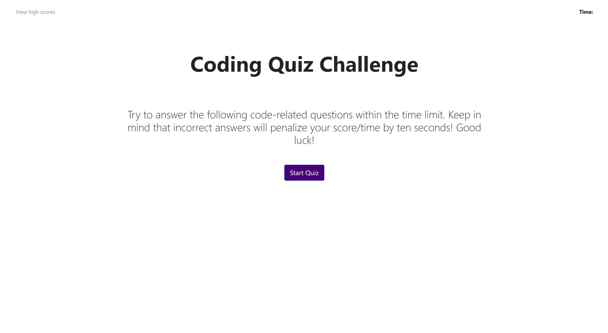
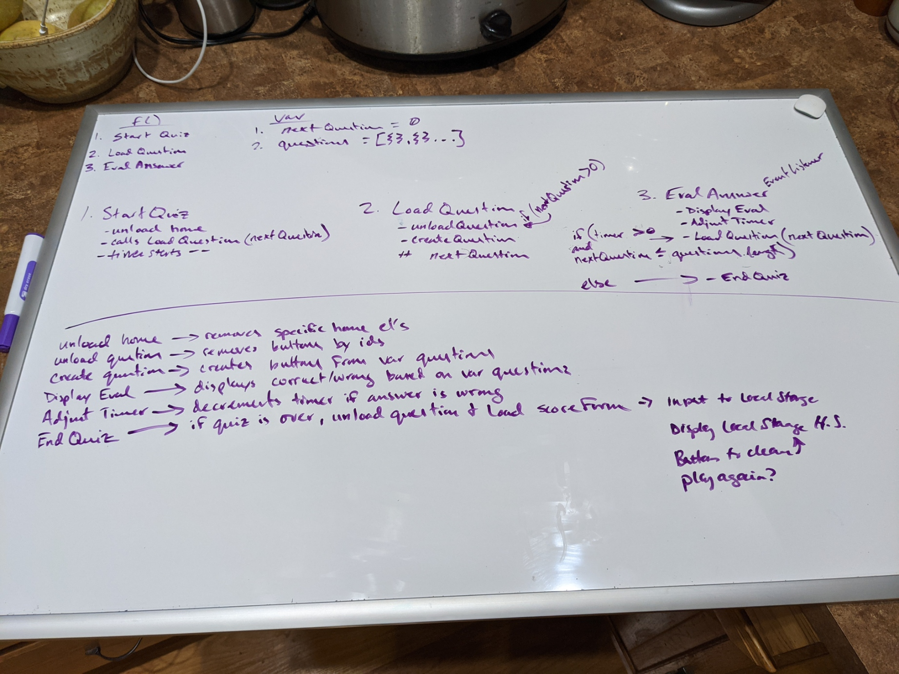

# JavaScript Timed Quiz

## Table of Contents
*[About the Project](About-the-Project)
*[View the Project](View-The-Project)
*[Challenges Faced](#Challenges-Faced)
*[What I Enjoyed!](#What-I-Enjoyed)
*[Credits](#Credits)
*[Online Resources](#Online-Resources)
*[License](#License)
*[Contact](#Contact)
### About the Project

When "Start Quiz" button is pressed, users are presented with a short quiz on JavaScript fundamentals. Time elapses in one corner, and additional time is deducted as a penalty for wrong answers. At the end of the quiz, all are invited to enter their initials and view high scores stored on the leader board. 

### View the Project

https://crosenfrisk.github.io/coding-quiz-challenge/

### Challenges Faced

In December, I struggled to get the timer to work as desired. Getting the penalty to register on the timer was not as simple as I had envisioned. I was able to fix this in January.

Additional challenges include: getting quiz question array to cycle, as well as getting option elements to be visible on html page *at times only one object would display while others disappeared* Thankfully this has also been fixed.

*Update 2/16/22: Local storage is still an area that I struggle with. It has been almost a month since my last work on this project. I am submitting what I have with the hope that I can still get help from my tutor to complete the last leg of this project with regard to the high score page.*

** Update 2/19/22: Local storage fixed! High score page dynamically generates and loads stored scores, added function to clear high scores and option to return to main page. **

### What I Enjoyed

I enjoyed using Bootstrap for the first time and liked setting up my hmtl pages. I decided to use multiple pages rather than hiding and then revealing elements via CSS because it lead to a clearer back-end experience for me as the developer. Each page had its own purpose. 

Initially I created three html pages: `index.html ` was the landing page where the user could see they had options to either `Start Game!` or `View High Scores` and be directed to the respective pages. `quiz.html` stored the html layout for the quiz with vertical button elements and the timer in the nav section, while `highscores.html` was simply for viewing/storing user input *initials* along with score.

*Update 2/16/22: After I learned about dynamically generating divs, I did away with the three pages and their links, and simply used `index.html` to display the landing page, quiz, and then high score page.*
### Credits

🎉 During the initial creation phase of this project, I had help from Google, W3Schools, MDN, and classmates Colin @soundproofboot and @Kyler-McLachlan (GitHub username). I also received general feedback from Manon of AskBCS, and Harrison our class TA.

🎉 *Update 2/16/22: My second iteration of the project involved creating a new white board to detail the flow of the project. @AndrewRosenfrisk discussed the importance of parameters with me and was a good listener any time I got stuck.*

🎉 *Update 2/19/22: Lilo Valdez gave me feedback regarding local storage which helped me complete this project.*

 

### Online Resources

[Displaying a message after a timer completes](https://stackoverflow.com/questions/5083534/how-do-you-display-a-message-once-a-javascript-function-restarts) as suggested by [Dominic Tancredi](https://stackoverflow.com/users/1247659/dominic-tancredi) on Stack Overflow from February 2011.

W3Schools Example of [setInterval()](https://www.w3schools.com/jsref/tryit.asp?filename=tryjsref_win_setinterval3).

An [example](https://www.elated.com/javascript-timers-with-settimeout-and-setinterval/) of JavaScript Timers and setInterval() from Matt Doyle of Elated Communications.

Someone's [query](https://stackoverflow.com/questions/4435776/simple-clock-that-counts-down-from-30-seconds-and-executes-a-function-afterward) on Stack Overflow, which sounded like mine.

[Build a Countdown Timer in Just 18 Lines of JavaScript](https://www.sitepoint.com/build-javascript-countdown-timer-no-dependencies/) by Yaphi Berhanu, Nilson Jacques from June 1, 2020. *I liked their idea as a starting off point, but it was completely different from my project, since theirs was answering all questions and then submitting, not filtering through question by question, like mine.*

[Course Material from Trilogy Education and the Univeristy of Minnesota](https://courses.bootcampspot.com/courses/1215/pages/5-dot-5-4-schedule-task-auditing?module_item_id=367554) on JavaScript timers: setTimeout() and setInterval();

### MIT License

Copyright (c) 2021 Claire Rosenfrisk

Permission is hereby granted, free of charge, to any person obtaining a copy
of this software and associated documentation files (the "Software"), to deal
in the Software without restriction, including without limitation the rights
to use, copy, modify, merge, publish, distribute, sublicense, and/or sell
copies of the Software, and to permit persons to whom the Software is
furnished to do so, subject to the following conditions:

The above copyright notice and this permission notice shall be included in all
copies or substantial portions of the Software.

THE SOFTWARE IS PROVIDED "AS IS", WITHOUT WARRANTY OF ANY KIND, EXPRESS OR
IMPLIED, INCLUDING BUT NOT LIMITED TO THE WARRANTIES OF MERCHANTABILITY,
FITNESS FOR A PARTICULAR PURPOSE AND NONINFRINGEMENT. IN NO EVENT SHALL THE
AUTHORS OR COPYRIGHT HOLDERS BE LIABLE FOR ANY CLAIM, DAMAGES OR OTHER
LIABILITY, WHETHER IN AN ACTION OF CONTRACT, TORT OR OTHERWISE, ARISING FROM,
OUT OF OR IN CONNECTION WITH THE SOFTWARE OR THE USE OR OTHER DEALINGS IN THE
SOFTWARE.

## Contact

If you have questions or would like to make suggestions or contributions, please email me at [claire.rosenfrisk@gmail.com](mailto:claire.rosenfrisk@gmail.com).

Feel free to follow my work on GitHub     [@crosenfrisk](https://github.com/crosenfrisk). Thank you for your time and for visiting my repository.

